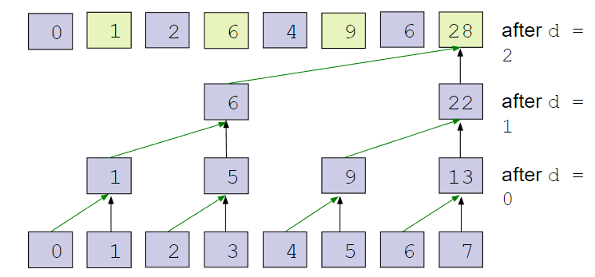
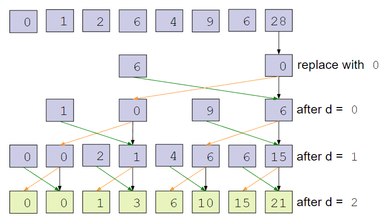
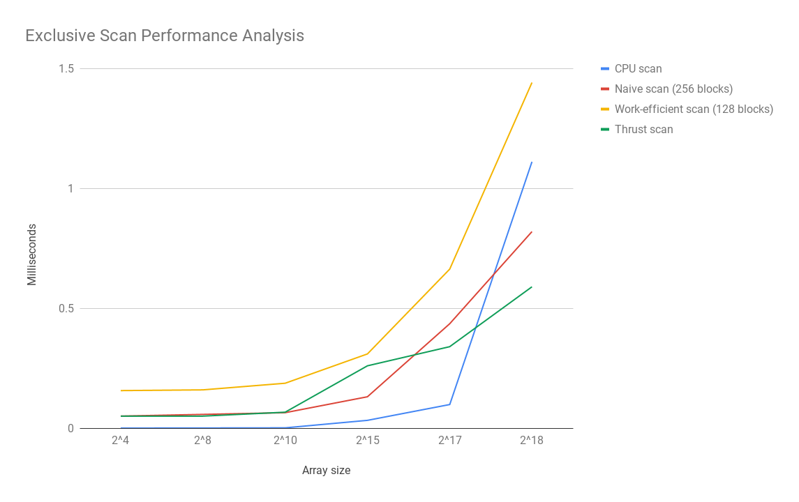
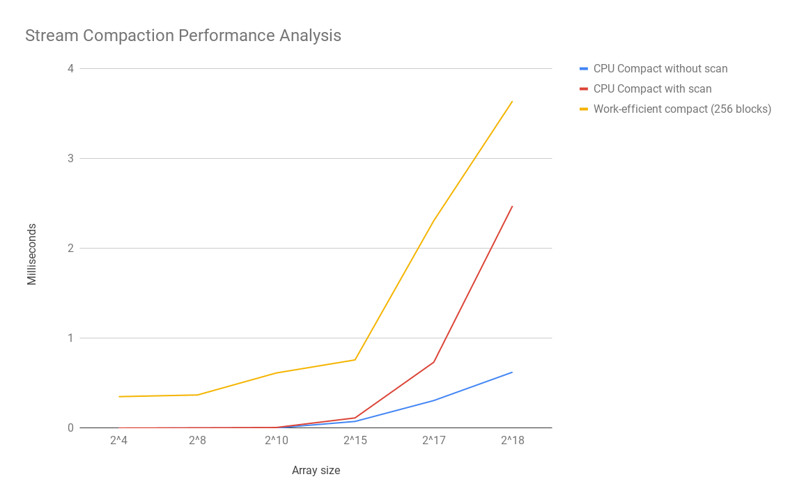

CUDA Stream Compaction
======================

**University of Pennsylvania, CIS 565: GPU Programming and Architecture, Project 2**

## Stream Compaction and Scan Algorithms with CUDA on the GPU
### Connie Chang
  * [LinkedIn](https://www.linkedin.com/in/conniechang44), [Demo Reel](https://www.vimeo.com/ConChang/DemoReel)
* Tested on: Windows 10, Intel Xeon CPU E5-1630 v4 @ 3.70 GHz, GTX 1070 8GB (SIG Lab)

## Introduction
This project explores different algorithms for stream compaction and exclusive scan, implemented in parallel with CUDA. We compare their performances to see which one is the best.  

  
An image from _GPU Gems_, illustrating the naive scan algorithm.  

__Exclusive Scan__  
Exclusive scan takes an array of integers as input and outputs another array of integers of the same length. Each element of the output is the sum of all previous elements of the input, excluding the current element. (For example, output[i] = sum(input[0] + ... +  input[i - 1]).  

__Stream Compaction__  
Stream compaction takes an array of integers as input and removes all the zeroes in it. Therefore, it outputs another array of integers that is of the same length or shorter. (For example, an input of [1, 5, 0, 3, 6, 0, 9] would result in [1, 5, 3, 6, 9])

## CPU Implementation
The CPU implementation is the most basic of the implementations in this project. The results from here become the baseline for comparison with later methods. 

__Exclusive Scan__  
On the CPU, exclusive scan is a simple FOR loop summing up all the elements in the input array. The pseudocode is as follows:
```
sum = 0
for (i = 0 ... (n - 1))  // n is size of input
    output[i] = sum
    sum += input[i]
```
 
 __Stream Compaction__
Likewise, stream compaction loops through all elements of the input array. If the element is not a zero, add it to the end of the output.  
```
count = 0
for (i = 0 ... (n - 1))  // n is size of input
    if input[i] != 0
        output[count] = input[i]
        count++
```

__Stream Compaction using Scan__  
This implementation is more interesting because it uses two other algorithms (scan and scatter) to complete stream compaction. First, the input is mapped to an array of 0s and 1s. If the input is a 0, then the map contains a 0 at the element. Otherwise, it is a 1. For example,  
```
input = [1, 5, 0, 3, 6, 0, 9]  
```
maps to
```
01 map = [1, 1, 0, 1, 1, 0, 1] 
```
Next, the 01 map is scanned using an exclusive scan. The result of the scan gives the index of where each non-zero element goes in the final output. For our example,  
```
scan of 01 map = [0, 1, 2, 2, 3, 4, 4] 
```
Finally, to achieve the final result, we loop through the 01 map. If the current position contains a 1, we know the element in the input array at that position should be in the output. The find what index it should be in for the output, we look at the scan of 01 map. The number at the current position is the final index. Then, we just copy the input element to the corresponding index in the output.  

Here's the pseudocode of the entire algorithm:  
```
// Map input to 01 map
for (i = 0 ... (n - 1))  // n is length of input
    if (input[i] == 0)
        01map[i] = 0
    else
        01map[i] = 1
        
// Run exclusive scan on 01map
scan = exclusive scan(01map)

for (i = 0 ... (n - 1))
    if 01map[i] == 1
        output[scan[i - 1]] = input[i]
```

## GPU Naive Algorithms
The naive algorithm on the GPU has to take advantage of the GPU's parallelism. The algorithm starts by replacing the current element with the sum of the current element and the one before it. Then, the current element is replaced by the sum of it and the integer 2 positions before it. Then, it's the sum of itself and the integer 2^2=4 positions before. Then, itself and 2^3=8 positions before. And so on, until 2^(k) exceeds the size of the array. The image below, from *GPU Gems,* illustrates this method:  

  

Note that this creates an inclusive scan. We need to convert it to an exclusive scan by shifting every element to the right and adding a zero to the beginning.  

The pseudocode for the CPU side is:  
```
for (k = 1 ... ilog2(n))  // n is size of input
    Launch kernel, passing in k
```

The pseudocode for the device kernel is:  
```
if (index >= 2^k)
    output[index] = input[index - 2^k] + input[index]
else
    output[index] = input[index]
```

## GPU Work-Efficient Algorithms
The work efficient algorithm is somewhat similar to naive but with some improvements (maybe? See Performance Analysis below). The algorithm has two steps: Up-Sweep and Down-Sweep. Up-Sweep starts by going to every other element and summing itself with the previous element. It replaces the current element with the sum. Then, it does the same for the new integers. And so on, until there is only one new sum. In a sense, you are building up a tree. The image below, taken from CIS 565 slides, demonstrates this:  
  

The Down-Sweep is more complicated. First, the last element is set to 0. Then, each element passes its value to its left child in the tree. The right child is the sum of the current value and the left child's previous value. This process is repeated as we work down the tree. The image, also taken from CIS 565 slides, illustrates this:  
  

The pseudocode is as follows:  
```
// Up Sweep
for k = 0 ... ilogceil(n)  // n is size of input
    Launch Up Sweep kernel
    
Set last element of Up Sweep result to 0

// Down Sweep
for k = (ilogceil(n) - 1) ... 0
    Launch Down Sweep kernel
```

Pseudocode for Up Sweep kernel:  
```
if (index % 2^(k+1) == 0)
    data[index + 2^(k+1) - 1] += data[index + 2^k - 1]
```

Pseudocode for Down Sweep kernel:
```
if (index % 2^(k+1) == 0)
    temp = data[index + 2^k - 1]
    data[index + 2^k - 1] = data[index + 2^(k+1) - 1]  // Set left child to current element
    data[index + 2^(k+1) - 1] += temp  // Set current element to sum of itself and left child
```

## GPU Thrust Function 
For performance comparison, I also ran thrust's implementation of exclusive scan.  

## Example Output from the Program  
Here is an example of what the program outputs to the terminal. This run was done on an array size of 2^8. The tests were given in class, but I copied the Thrust tests to make each of them run twice.    
```
****************
** SCAN TESTS **
****************
    [   4   4  39  19  26  38  40  32  19  14   0  28  20 ...   2   0 ]
==== cpu scan, power-of-two ====
   elapsed time: 0.0005ms    (std::chrono Measured)
    [   0   4   8  47  66  92 130 170 202 221 235 235 263 ... 5837 5839 ]
==== cpu scan, non-power-of-two ====
   elapsed time: 0.0002ms    (std::chrono Measured)
    [   0   4   8  47  66  92 130 170 202 221 235 235 263 ... 5785 5792 ]
    passed
==== naive scan, power-of-two ====
   elapsed time: 0.058368ms    (CUDA Measured)
    passed
==== naive scan, non-power-of-two ====
   elapsed time: 0.05632ms    (CUDA Measured)
    passed
==== work-efficient scan, power-of-two ====
   elapsed time: 0.149504ms    (CUDA Measured)
    passed
==== work-efficient scan, non-power-of-two ====
   elapsed time: 0.156672ms    (CUDA Measured)
    passed
==== thrust scan, power-of-two ====
   elapsed time: 4.34893ms    (CUDA Measured)
    passed
==== thrust scan, power-of-two ====
   elapsed time: 0.048128ms    (CUDA Measured)
    passed
==== thrust scan, non-power-of-two ====
   elapsed time: 0.063488ms    (CUDA Measured)
    passed
==== thrust scan, non-power-of-two ====
   elapsed time: 0.053248ms    (CUDA Measured)
    passed

*****************************
** STREAM COMPACTION TESTS **
*****************************
    [   0   2   3   1   0   0   2   2   3   2   0   2   0 ...   0   0 ]
==== cpu compact without scan, power-of-two ====
   elapsed time: 0.0008ms    (std::chrono Measured)
    [   2   3   1   2   2   3   2   2   2   3   3   1   2 ...   2   1 ]
    passed
==== cpu compact without scan, non-power-of-two ====
   elapsed time: 0.0009ms    (std::chrono Measured)
    [   2   3   1   2   2   3   2   2   2   3   3   1   2 ...   1   2 ]
    passed
==== cpu compact with scan ====
   elapsed time: 0.0036ms    (std::chrono Measured)
    [   2   3   1   2   2   3   2   2   2   3   3   1   2 ...   2   1 ]
    passed
==== work-efficient compact, power-of-two ====
   elapsed time: 0.4608ms    (CUDA Measured)
    passed
==== work-efficient compact, non-power-of-two ====
   elapsed time: 0.723968ms    (CUDA Measured)
    passed
Press any key to continue . . .
```  

## Performance Analysis
The tables and graphs below show how long each algorithm took (in milliseconds) to scan/compact a given array size. To find the ideal block size, I ran each algorithm using 128, 256, and 512 blocks, and used the fastest time for each. The times are measured using a CPU timer and GPU timer. None of memory allocation is included in the timings. All the arrays in the analysis have sizes that are powers of two. However, the algorithms work on non-power-of-two sizes as well. Once array sizes reach the order of 2^19, cudaMalloc failes. Presumably because there are too many intermediate arrays of large lengths and there is not enough memory.  

__Exclusive Scan Table__  

| Array Size | CPU Scan | Naive Scan (256 blocks) | Work-efficient Scan (128 blocks) | Thrust scan |
| ------------- | ------------- | ----- | ----- | ----- |
| 2^4  | 0.0002 | 0.050176 | 0.156672 | 0.050176 |
| 2^8  | 0.0006 | 0.057344 | 0.159744 | 0.050176 |
| 2^10 | 0.0012 | 0.064512 | 0.187392 | 0.066560 |
| 2^15 | 0.0325 | 0.130912 | 0.309696 | 0.260096 | 
| 2^17 | 0.0985 | 0.435616 | 0.663552 | 0.339968 |
| 2^18 | 1.1116 | 0.820160 | 1.442270 | 0.589824 |
  
__Exclusive Scan Graph__  
  

__Stream Compaction Table__  

| Array Size | CPU Compact without scan | CPU Compact with scan | Work-efficient compact (256 blocks) |
| ----- | ----- | ----- | ----- |
| 2^4  | 0.0002 | 0.0013 | 0.351232 |
| 2^8  | 0.0008 | 0.0038 | 0.369664 |
| 2^10 | 0.0025 | 0.0076 | 0.614400 |
| 2^15 | 0.0752 | 0.1144 | 0.759808 |
| 2^17 | 0.3076 | 0.7340 | 2.308100 |
| 2^18 | 0.6233 | 2.4728 | 3.639300 | 
  
__Stream Compaction Graph__  
  

  
__Analysis Questions__  

_Can you find the performance bottlenecks? Is it memory I/O? Computation? Is it different for each implementation?_  

My guess is that memory I/O is a bottleneck for the work efficient methods. This is because of the step between Up Sweep and Down Sweep of scan. I need to copy data from the GPU to the CPU just to set the last element to zero. Then I copy this back to the GPU from the CPU. This memory transfer is extremely slow because it is between hardware. Likewise, stream compaction has extra memory copies between host and device. In fact, it copies data from GPU to CPU in order to pass the data to the CPU scan function, only to have the scan function copy this data back to the GPU before computation begins. This is a very inefficient step. This could be solved by copying the scan code into the compact function. Then, altering the scan code to work directly with the device arrays already in compact.  

For naive, the bottleneck is probably at the end, where I convert the inclusive scan result to exclusive scan. I do this sequentially in the CPU, looping through the entire array, and shifting their values. This would be much more efficient on the GPU.  

_What might be happening inside the Thrust implementation?_  

The first time Thrust runs exclusive scan, it takes a significant amount of time. For example, in the output above, it took 4.34893 ms. But the second time only took 0.048128 ms. Thrust must be instantiating something on the first run that it needs for exclusive scan. Those objects persist in memory throughout the lifetime of the program, so the next calls to thrust::exclusive_scan do not need to instantiate them again and can run faster.
